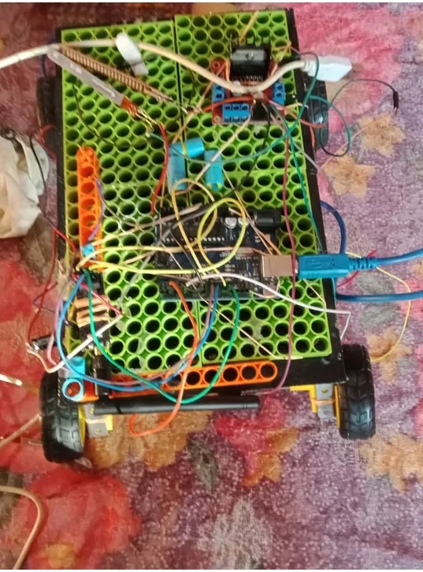
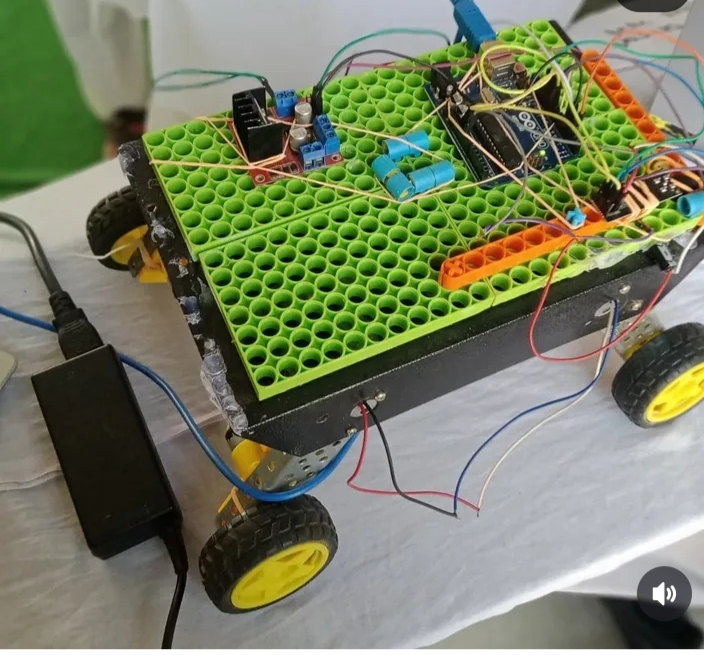
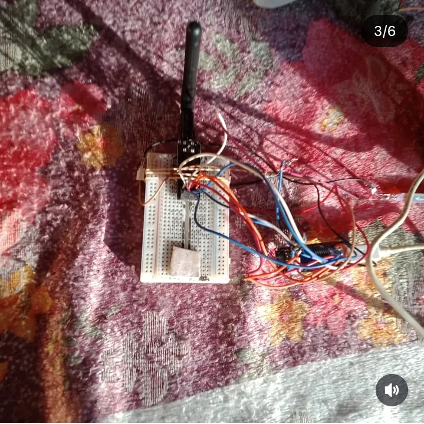
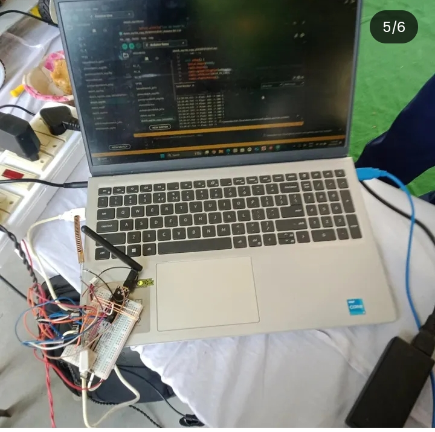

# 🤖 Hand Gesture Controlled Car using Arduino, MPU6050 & nRF24L01

This is my Arduino-based **Hand Gesture Controlled Car Project**.  
It moves in different directions according to hand gestures using an MPU6050 sensor and nRF24L01 wireless module.

---

## 🧠 Components Used
- Arduino UNO / Nano (2)
- MPU6050 sensor
- nRF24L01 module
- L298N motor driver
- DC motors & Car chassis
- Battery pack

---

## ⚙️ Working
1. The MPU6050 sensor detects hand tilt angles.  
2. The transmitter Arduino sends data via nRF24L01.  
3. The receiver Arduino controls the motor driver according to the gesture.  

---

## 📸 Project Images
Upload your car photos in this repository and rename them as:  
`gesturecar1.jpg`, `gesturecar2.jpg`, `gesturecar3.jpg`, `gesturecar4.jpg`  

Then it will show below:

> Tip: If you have only 3 photos, just use the first 3 and remove the fourth line.  

---

## 🌟 Credits
Created by **Kunal Atl**  

GitHub Repo: [hand-gesture-car](https://github.com/kunalatl-design/hand-gesture-car)
